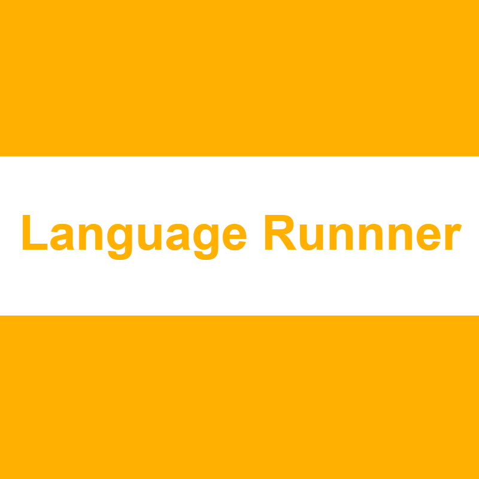

<section align="center">

  

   
</section>

---

Welcome to Language Runner! It is the quick and easy extension to run:

- R
- C
- C++
- VB .NET

in VS Code! More languages are on the way, alongside snippets for supported languages!

## Installation

### From the Marketplace
Search `language-runner` and install the one with the icon like ours.

### From Source
To install, visit the Github Repository and download the .VSIX file from the Releases page with the latest stable release. Then, using the Extensions tab, click the 3 dots (`...`) and click _`Install from .VSIX`_. Use the VSIX you downloaded and there you go! Language Runner is setup on your machine!
